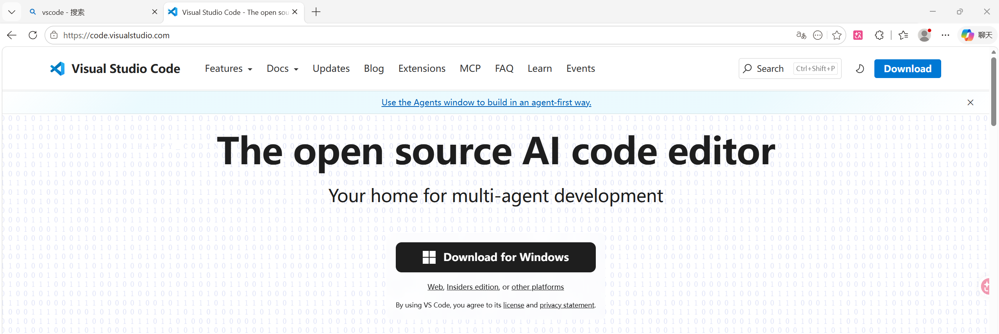
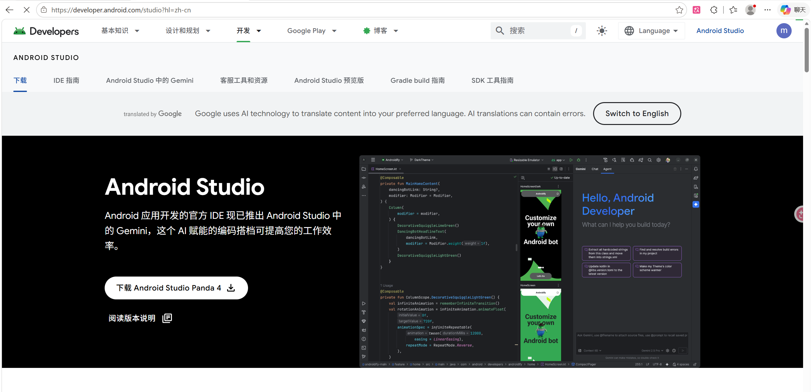
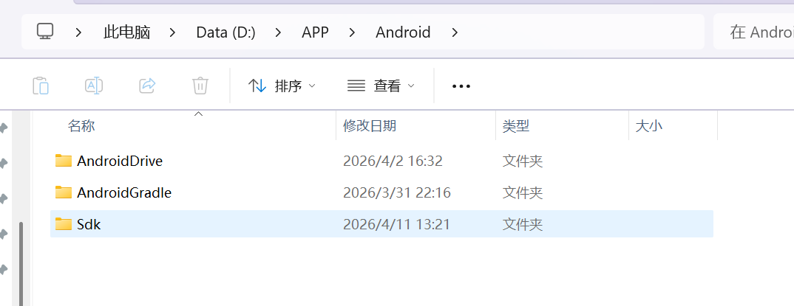

Android Studio、Anaconda（Jupyter Notebook）、Visual Studio Code这几款软件之前已经安装好了，所以省略了详细的步骤

## 安装VScode

搜索网址，点击下载即可，如下图所示：

下载后，双击运行，将安装修改为自定义的路径后，一直点击next即可。安装完成。

## 安装Anaconda（Jupyter Notebook）

搜索以下网址https://www.anaconda.com/download/success，开始下载即可

下载后，双击进行，将安装修改为自定义的路径后，一直点击next即可。安装完成。

在软件内搜索Jupyter Notebook，然后安装即可

## Android Studio

进入[下载 Android Studio 和应用工具 - Android 开发者  | Android Developers](https://developer.android.com/studio?hl=zh-cn)开始下载即可

支持软件安装全部完成